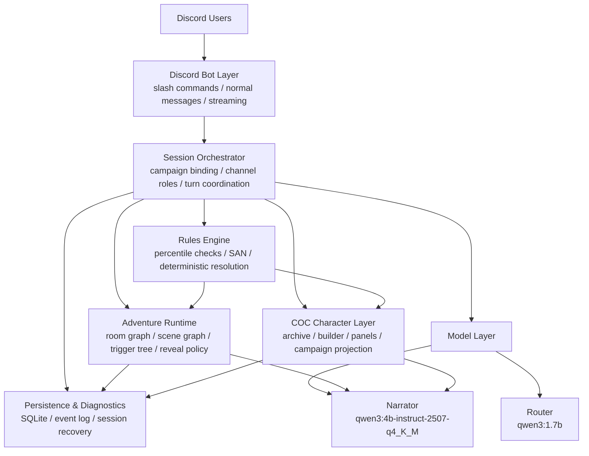
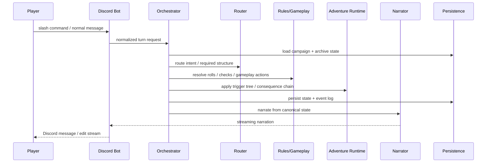

# Discord AI Keeper

本项目是一个运行在 Discord 里的、本地模型驱动的 **Call of Cthulhu Keeper 系统**。它不是单纯的聊天 bot，而是一个把 Discord、COC 规则、结构化模组运行时、长期角色档案和 AI 叙事层拼在一起的多人跑团框架。

核心目标很明确：

- 多个真人玩家在 Discord 里直接跑团
- AI 负责 Keeper 叙事、NPC 扮演、场景推进
- 规则、模组状态、线索揭露、后果链尽量由系统托管
- 模组不是纯提示词，而是可结构化、可迁移、可复用的数据
- 长期角色和模组内实例分离，方便跨模组持续使用

## Why This Exists

现成产品能解决一部分问题，但很难同时满足这些条件：

- Discord 原生使用
- 本地模型部署
- 中文叙事
- COC/Keeper-first
- 结构化模组运行
- 私有信息 / 多入口 / 长状态链
- 可自己扩展和改造

所以这个项目的思路不是“做一个万能聊天 DM”，而是做一个 **本地、可控、可演进的 Discord COC 运行时**。

## Architecture



### 关键分层

- **Discord 层**
  负责 slash commands、普通消息监听、分频道职责、流式输出。

- **Session / Orchestrator 层**
  负责 campaign 绑定、turn 协调、角色投影、模式切换、消息路由。

- **Adventure Runtime 层**
  负责模组结构、room graph、scene/event graph、trigger tree、reveal policy、结局条件。

- **Rules 层**
  负责 COC 骰子、成功等级、SAN、明确的规则结算。

- **Character / Archive 层**
  负责长期调查员档案、对话建卡、调查员面板、模组实例投影。

- **Model 层**
  `router` 负责结构化判断，`narrator` 负责叙事和角色表演。

- **Persistence / Diagnostics 层**
  负责 SQLite、事件日志、状态恢复、调试摘要。

## Design Principles

- **状态真相不交给模型**
  AI 可以说话、提问、总结，但 canonical truth 必须落在结构化状态、规则结算和触发器执行里。

- **模组优先结构化**
  不靠“把整篇剧本塞给模型然后自由发挥”。模组应该有 room/scene/event graph、trigger tree、state fields、reveal gates。

- **规则和叙事分离**
  规则层决定能不能、发生了什么；叙事层决定怎么把这件事说得像 Keeper。

- **长期角色和模组实例分离**
  玩家档案是长期资产；模组里的 SAN、秘密、入口身份、临时状态是实例状态。

- **优先复用成熟方案**
  骰子、Discord 调度、TRPG 交互模式优先参考成熟项目，不做无意义重造。

## Product Tracks

为了让协作者和 GSD 类 AI 在 fork 仓库后也能快速判断“下一步该做什么”，项目现在按 4 条长期 Track 理解：

- **Track A: 模组与规则运行层**
  - 负责 COC 规则、模组 schema、room/scene/event graph、trigger、consequence、reveal policy。
- **Track B: 人物构建与管理层**
  - 负责 builder、archive、profile lifecycle、campaign projection、管理员角色治理。
- **Track C: Discord 交互层**
  - 负责 slash commands、频道职责、自然消息、ephemeral/DM、启动与交付检查。
- **Track D: 游戏呈现层**
  - 负责 Keeper 风格呈现、提示边界、线索板/历史板/角色板的可读性和沉浸感。

新 milestone 应该优先归属到其中一条 Track，而不是混成一个宽而散的 feature 包。

## Global Rules

无论推进哪条 Track，都要遵守这些全局规则：

1. 每个 milestone 必须有一个主 Track。
2. 数值真相、规则真相、状态真相不能只靠 prompt，必须来自本地规则书、确定性代码或显式模组特规。
3. 关键状态变化必须可持久化、可审计。
4. 宣称“可交付”前，至少要通过：
   - `uv run pytest -q`
   - `uv run python -m dm_bot.main smoke-check`
5. 新功能优先做成可复用 runtime 能力，而不是单模组硬编码。

## Milestone History

### v1.0 Foundations

- 建好 Discord runtime、双模型结构、持久化、诊断、自然消息多人流程
- 让 bot 从 demo 变成可玩的基础框架

### v1.1 Formal Modules

- 引入正式 adventure package
- `疯狂之馆` 成为第一个结构化正式模组

### v1.2 Playability

- 完成 ready-up 开场流程
- 引入成熟骰子系统
- 加入真流式 Discord 输出

### v1.3 Keeper Feel

- 判定触发、轻提示、卡关恢复、场景 framing 明显更像 Keeper

### v1.4 Location-First Runtime

- 从线性场景改成 room graph / location-first 模型

### v1.5 Trigger Engine

- 做出 trigger tree + consequence engine + event log

### v1.6 COC Pivot

- 从 D&D-first 正式切到 COC/Keeper-first
- 本地规则书、预生角色、COC 语义进入 runtime

### v1.7 Complex COC Modules

- 调查员面板、私有信息、mixed graph、`覆辙` 样板

### v1.8 - v1.9 Character Identity

- 角色档案频道 / 游戏大厅分层
- 对话建卡
- 长期档案和 campaign projection 分离
- 自适应角色采访与 richer archive identity

### v2.0 Archive Deepening

- archive schema 更丰富
- `/profile_detail` 和更完整的人物卡展示
- AI 语义归档写回 archive，但数值仍受 COC 规则限制

### v2.1 Delivery & Governance

- 本地 smoke check
- 单主角色治理
- 管理员角色管理起步

完整总结见：
- [.planning/reports/MILESTONE_SUMMARY-v2.1.md](C:/Users/Lin/Documents/Playground/.planning/reports/MILESTONE_SUMMARY-v2.1.md)

## Current Runtime Flow



## Current Capabilities

### Discord Runtime

- slash commands
- 普通消息跑团
- Discord 流式叙事
- 频道角色分层
- campaign 绑定和恢复

### Adventure Runtime

- formal module package
- room graph
- mixed room/scene/event graph
- trigger tree
- consequence chain
- reveal-safe runtime

### COC Runtime

- 百分骰检定
- 成功等级
- bonus / penalty dice
- pushed roll
- SAN check
- 规则与模组特规分层

### Character Layer

- 长期 archive profile
- 调查员面板
- 自适应对话建卡
- richer archive fields
- campaign projection

### Modules

- `mad_mansion` / `疯狂之馆`
- `fuzhe` / `覆辙` 复杂模组样板

## Project Layout

```text
src/dm_bot/
  adventures/      structured modules, graphs, triggers, extraction
  characters/      import sources and base character models
  coc/             archive, builder, panels, COC asset handling
  diagnostics/     runtime summaries and debug output
  discord_bot/     Discord client, commands, streaming transport
  gameplay/        combat and scene presentation helpers
  models/          Ollama/OpenAI-compatible client and model schemas
  narration/       narrator prompt and response shaping
  orchestrator/    turn pipeline, session runtime, gameplay integration
  persistence/     SQLite-backed state store
  router/          structured turn routing contracts and service
  rules/           dice, COC checks, deterministic rule resolution
  runtime/         app health, startup checks, smoke check
```

## Local Models

默认模型分工：

- **Router**: `qwen3:1.7b`
- **Narrator**: `qwen3:4b-instruct-2507-q4_K_M`

选择原则：

- `router` 要快、稳定、结构化
- `narrator` 要中文更稳、适合 Keeper 叙事
- 都要能在 `8GB VRAM + 32GB RAM` 这一类机器上实际跑起来

## Setup

1. 复制 `.env.example` 为 `.env`
2. 填写 `DM_BOT_DISCORD_TOKEN`
3. 可选填写 `DM_BOT_DISCORD_GUILD_ID`
4. 确保本地 `Ollama` 已拉好模型：
   - `qwen3:1.7b`
   - `qwen3:4b-instruct-2507-q4_K_M`
5. 启动前检查：

```powershell
uv run python -m dm_bot.main preflight
uv run python -m dm_bot.main smoke-check
```

6. 启动 bot：

```powershell
uv run python -m dm_bot.main run-bot
```

## Discord Usage Model

推荐频道职责分离：

- `#角色档案`
  - `/sheet`
  - `/profiles`
  - `/profile_detail`
  - `/start_builder`

- `#游戏大厅`
  - `/bind_campaign`
  - `/join_campaign`
  - `/load_adventure`
  - `/ready`
  - 普通消息推进剧情

- `#kp-trace`
  - diagnostics / 管理 / 调试

- `#admin`
  - 角色治理和管理员操作

## What Is Still Missing

项目已经很大了，但还远没到“成熟产品”。

当前最明显的欠缺有：

- Discord 启动与交付流程刚开始收紧，仍需持续验证
- 管理员角色治理只是第一层，还不够完整
- archive / builder / panel 仍有进一步整合空间
- 多人复杂模组的私有信息流还可以更强
- 真正富 UI 的角色卡 / 线索板 / 地图板还没做，后面大概率要走 Discord Activity
- 模组提取与作者工作流还不够成熟，不适合多人协作时大规模加模组

## Collaboration Notes

这个仓库之后会上 GitHub 供多人协作，所以推荐协作者先理解这几点：

- 先看 `.planning/PROJECT.md` 里的 Track 和 Global Rules，再决定当前工作属于哪一层
- 再看 `.planning/ROADMAP.md` 选择该 Track 的下一个 milestone
- 用 `.planning/STATE.md` 判断当前激活的是哪条 Track，避免多人同时改同一层
- 不要把 prompt 当真相来源，真相在结构化状态里
- 规则变化要先看本地 COC 规则边界，不要直接让模型自由发挥
- 优先补通用 runtime，不要急着对单个模组打大量专属补丁
- 交付前先跑：

```powershell
uv run pytest -q
uv run python -m dm_bot.main smoke-check
```

## Useful Commands

```powershell
uv run python -m dm_bot.main preflight
uv run python -m dm_bot.main smoke-check
uv run python -m dm_bot.main run-bot
uv run python -m dm_bot.main run-api
```

## Current Status

这不是一个“刚起步的聊天 bot”。它已经是一个：

- Discord-native
- local-model-first
- COC/Keeper-first
- structured-module-driven
- archive-aware
- multiplayer-ready

的运行时系统。

接下来的重点不再是“证明这个方向能跑”，而是：

- 提高协作可维护性
- 提高模块化和治理能力
- 提高真实多人跑团的稳定性和可控性
